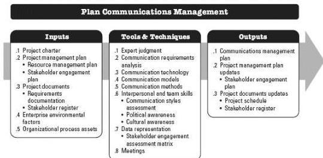

## 10.1 PLAN COMMUNICATIONS MANAGEMENT

Plan Communications Management is the process of developing an appropriate approach and plan for project communications activities based on the information needs of each stakeholder or group, available organizational assets, and the needs of the project. The key benefit of this process is a documented approach to effectively and efficiently engage stakeholders by presenting relevant information in a timely manner. This process is performed periodically throughout the project as needed. The inputs, tools and techniques, and outputs of the process are depicted in Figure 10-2. Figure 10-3 depicts the data flow diagram for the process.

Figure 10-2. Plan Communications Management: Inputs, Tools & Techniques, and Outputs

364