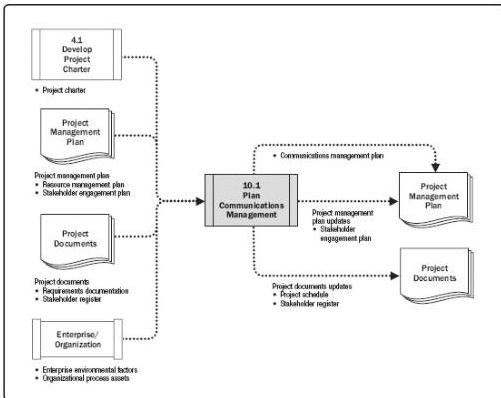

Figure 10-3. Plan Communications Management: Data Flow Diagram

An effective communications management plan that recognizes the diverse information needs of the project's stakeholders is developed early in the project life cycle. It should be reviewed regularly and modified when necessary, when the stakeholder community changes or at the start of each new project phase.

On most projects, communications planning is performed very early, during stakeholder identification and project management plan development.

While all projects share the need to communicate project information, the information needs and methods of distribution may vary widely. In addition, the methods of storage, retrieval, and ultimate disposition of the project information need to be considered and documented during this process. The results of the Plan Communications Management process should be reviewed regularly throughout the project and revised as needed to ensure continued applicability.

## 10.1.1 PLAN COMMUNICATIONS MANAGEMENT: INPUTS

### 10.1.1.1 PROJECT CHARTER

Described in Section 4.1.3.1. The project charter identifies the key stakeholder list. It may also contain information about the roles and responsibilities of the stakeholders.

365