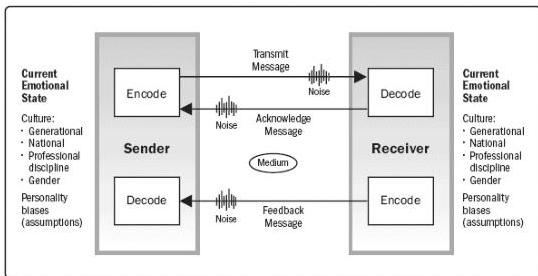

through active listening, described in Section 10.2.2.6.

As part of the communication process, the sender is responsible for the transmission of the message, ensuring the information being communicated is clear and complete, and confirming the message is correctly interpreted. The receiver is responsible for ensuring that the information is received in its entirety, interpreted correctly, and acknowledged or responded to appropriately. These components take place in an environment where there will likely be noise and other barriers to effective communication.

Cross-cultural communication presents challenges to ensuring that the meaning of the message has been understood. Differences in communication styles can arise from differences in working methods, age, nationality, professional discipline, ethnicity, race, or gender. People from different cultures communicate using different languages (e.g., technical design documents, different styles) and expect different processes and protocols.

The communication model shown in Figure 10-4 incorporates the idea that the message itself and how it is transmitted are influenced by the sender's current emotional state, knowledge, background, personality, culture, and biases. Similarly, the receiver's emotional state knowledge, background, personality, culture, and biases will influence how the message is received and interpreted, and will contribute to the barriers or noise.

This communication model and its enhancements can assist in developing communication strategies and plans for person-to-person or even small group to small group communications. It is not useful for other communications artifacts such as emails, broadcast messages, or social media.

Figure 10-4. Communication Model for Cross-Cultural Communication

10.1.2.5 COMMUNICATION METHODS

370