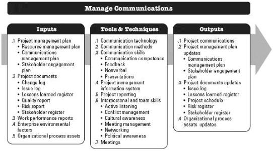

methods and techniques to accommodate the changing needs of stakeholders and the project. The inputs, tools, techniques, and outputs of this process are depicted in Figure 10-5. Figure 10-6 depicts the data flow diagram of the Manage Communications process.

Figure 10-5. Manage Communications: Inputs, Tools & Techniques, and Outputs

375