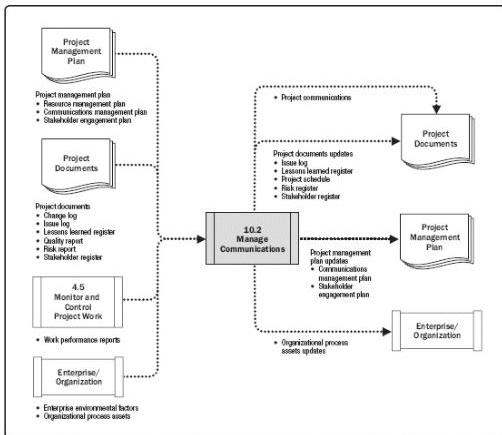

Figure 10-6. Manage Communications: Data Flow Diagram

This process goes beyond the distribution of relevant information and seeks to ensure that the information being communicated to project stakeholders has been appropriately generated and formatted, and received by the intended audience. It also provides opportunities for stakeholders to make requests for further information, clarification, and discussion. Techniques and considerations for effective communications management include but are not limited to:

- ◆ Sender-receiver models. Incorporating feedback loops to provide opportunities for interaction/participation and remove barriers to effective communication.
- ◆ Choice of media. Decisions about application of communications artifacts to meet specific project needs, such as when to communicate in writing versus orally, when to prepare an informal memo versus a formal report, and when to use push/pull options and the choice of appropriate technology.
- ◆ Writing style. Appropriate use of active versus passive voice, sentence structure, and word choice.
- ◆ Meeting management. Described in Section 10.2.2.6. Preparing an agenda,

376