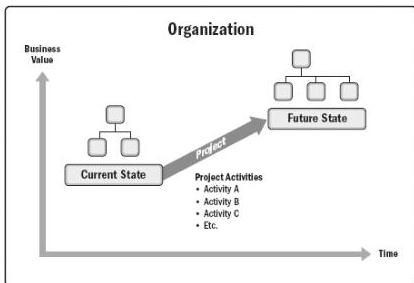

and achieving the specific objective. For more information on project management and change, see *Managing Change in Organizations: A Practice Guide* [6].

Figure 1-1. Organizational State Transition via a Project

◆ Projects enable business value creation. PMI defines business value as the net quantifiable benefit derived from a business endeavor. The benefit may be tangible, intangible, or both. In business analysis, business value is considered the return, in the form of elements such as time, money, goods, or intangibles in return for something exchanged (see *Business Analysis for Practitioners: A Practice Guide*, p. 185 [7]).

Business value in projects refers to the benefit that the results of a specific project provide to its stakeholders. The benefit from projects may be tangible, intangible, or both.

Examples of tangible elements include:

- Monetary assets,
- Stockholder equity,
- Utility,
- Fixtures,
- Tools, and
- Market share.

Examples of intangible elements include:

- Goodwill,

38