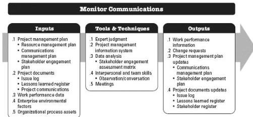

◆ Project records such as correspondence, memos, meeting minutes and other documents used on the project; and
◆ Planned and ad hoc project reports and presentations.

### 10.3 MONITOR COMMUNICATIONS

Monitor Communications is the process of ensuring the information needs of the project and its stakeholders are met. The key benefit of this process is the optimal information flow as defined in the communications management plan and the stakeholder engagement plan. This process is performed throughout the project. The inputs, tools and techniques, and outputs of the process are depicted in Figure 10-7. Figure 10-8 depicts the data flow diagram for the process.

Figure 10-7. Monitor Communications: Inputs, Tools & Techniques, and Outputs

383