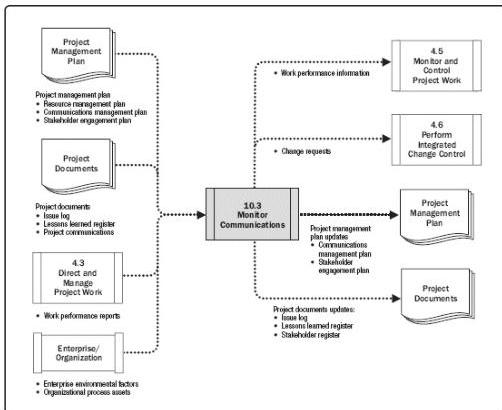

Figure 10-8. Monitor Communications: Data Flow Diagram

Monitor Communications determines if the planned communications artifacts and activities have had the desired effect of increasing or maintaining stakeholders' support for the project's deliverables and expected outcomes. The impact and consequences of project communications should be carefully evaluated and monitored to ensure that the right message with the right content (the same meaning for sender and receiver) is delivered to the right audience, through the right channel, and at the right time. Monitor Communications may require a variety of methods, such as customer satisfaction surveys, collecting lessons learned, observations of the team, reviewing data from the issue log, or evaluating changes in the stakeholder engagement assessment matrix described in Section 13.2.2.5.

The Monitor Communications process can trigger an iteration of the Plan Communications Management and/or Manage Communications processes to improve effectiveness of communication through additional and possibly amended communications plans and activities. Such iterations illustrate the continuous nature of the Project Communications Management processes. Issues or key performance indicators, risks, or conflicts may trigger an immediate revision.

### 10.3.1 MONITOR COMMUNICATIONS: INPUTS

384