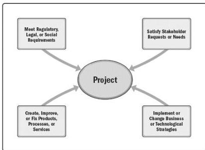

- ■ Brand recognition,
- ■ Public benefit,
- ■ Trademarks,
- ■ Strategic alignment, and
- ■ Reputation.

◆ Project Initiation Context. Organizational leaders initiate projects in response to factors acting upon their organizations. There are four fundamental categories for these factors, which illustrate the context of a project (see Figure 1-2):

- ■ Meet regulatory, legal, or social requirements;
- ■ Satisfy stakeholder requests or needs;
- ■ Implement or change business or technological strategies; and
- ■ Create, improve, or fix products, processes, or services.

Figure 1-2. Project Initiation Context

These factors influence an organization's ongoing operations and business strategies. Leaders respond to these factors in order to keep the organization viable. Projects provide the means for organizations to successfully make the changes necessary to deal with these factors. These factors ultimately should link to the strategic objectives of the organization and the business value of each project.

39