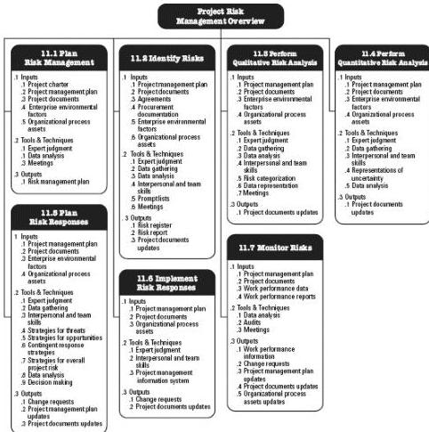

Figure 11-1. Project Risk Management Overview

## KEY CONCEPTS FOR PROJECT RISK MANAGEMENT

All projects are risky since they are unique undertakings with varying degrees of complexity that aim to deliver benefits. They do this in a context of constraints and assumptions, while responding to stakeholder expectations that may be conflicting and changing. Organizations should choose to take project risk in a controlled and intentional manner in order to create value while balancing risk and reward.

Project Risk Management aims to identify and manage risks that are not addressed by the other project management processes. When unmanaged, these risks have the potential to cause the project to deviate from the plan and fail to achieve the defined project objectives. Consequently, the effectiveness of Project Risk Management is directly related to project success.

Risk exists at two levels within every project. Each project contains individual risks that can affect the achievement of project objectives. It is also important to consider the riskiness of the overall project, which arises from the combination of individual project

390