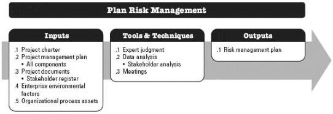
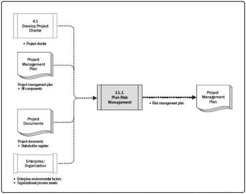

# 11.1 PLAN RISK MANAGEMENT

Plan Risk Management is the process of defining how to conduct risk management activities for a project. The key benefit of this process is that it ensures that the degree, type, and visibility of risk management are proportionate to both risks and the importance of the project to the organization and other stakeholders. This process is performed once or at predefined points in the project. The inputs, tools and techniques, and outputs of the process are depicted in Figure 11-2. Figure 11-3 depicts the data flow diagram for the process.

Figure 11-2. Plan Risk Management: Inputs, Tools & Techniques, and Outputs

Figure 11-3. Plan Risk Management: Data Flow Diagram

394