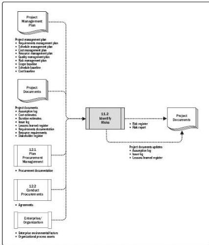

Figure 11-7. Identify Risks: Data Flow Diagram

Identify Risks considers both individual project risks and sources of overall project risk. Participants in risk identification activities may include the following: project manager, project team members, project risk specialist (if assigned), customers, subject matter experts from outside the project team, end users, other project managers, operations managers, stakeholders, and risk management experts within the organization. While these personnel are often key participants for risk identification, all project stakeholders should be encouraged to identify individual project risks. It is particularly important to involve the project team so they can develop and maintain a sense of ownership and responsibility for identified individual project risks, the level of overall project risk, and associated risk response actions.

When describing and recording individual project risks, a consistent format should be used for risk statements to ensure that each risk is understood clearly and unambiguously in order to support effective analysis and risk response development. Risk owners for individual project risks may be nominated as part of the Identify Risks process, and will be confirmed during the Perform Qualitative Risk Analysis process. Preliminary risk responses

402