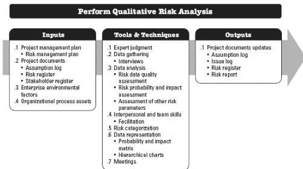

assumption log should be updated with this new information.

◆ Issue log. Described in Section 4.3.3.3. The issue log should be updated to capture any new issues uncovered or changes in currently logged issues.
◆ Lessons learned register. Described in Section 4.4.3.1. The lessons learned register can be updated with information on techniques that were effective in identifying risks to improve performance in later phases or other projects.

## 11.3 PERFORM QUALITATIVE RISK ANALYSIS

Perform Qualitative Risk Analysis is the process of prioritizing individual project risks for further analysis or action by assessing their probability of occurrence and impact as well as other characteristics. The key benefit of this process is that it focuses efforts on high-priority risks. This process is performed throughout the project. The inputs, tools and techniques, and outputs of the process are depicted in Figure 11-8. Figure 11-9 depicts the data flow diagram for the process.

Figure 11-8. Perform Qualitative Risk Analysis: Inputs, Tools & Techniques, and Outputs

410