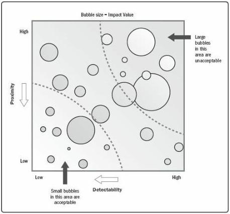

graphical representations are required. For example, a bubble chart displays three dimensions of data, where each risk is plotted as a disk (bubble), and the three parameters are represented by the x-axis value, the y-axis value, and the bubble size. An example bubble chart is shown in Figure 11-10, with detectability and proximity plotted on the x and y axes, and impact value represented by bubble size.

Figure 11-10. Example Bubble Chart Showing Detectability, Proximity, and Impact Value

### 11.3.2.7 MEETINGS

To undertake qualitative risk analysis, the project team may conduct a specialized meeting (often called a risk workshop) dedicated to the discussion of identified individual project risks. The goals of this meeting include the review of previously identified risks, assessment of probability and impacts (and possibly other risk parameters), categorization, and prioritization. A risk owner, who will be responsible for planning an appropriate risk response and for reporting progress on managing the risk, will be allocated to each individual project risk as part of the Perform Qualitative Risk Analysis process. The meeting may start by reviewing and confirming the probability and impact scales to be used for the analysis. The meeting may also identify additional risks during the discussion, and these should be recorded for analysis. Use of a skilled facilitator will increase the

416