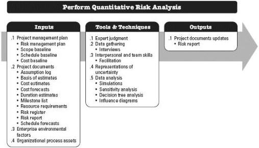
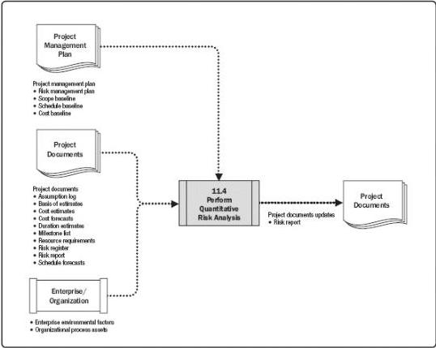

Figure 11-11. Perform Quantitative Risk Analysis: Inputs, Tools & Techniques, and Outputs

Figure 11-12. Perform Quantitative Risk Analysis: Data Flow Diagram

Perform Quantitative Risk Analysis is not required for all projects. Undertaking a robust analysis depends on the availability of high-quality data about individual project risks and

418