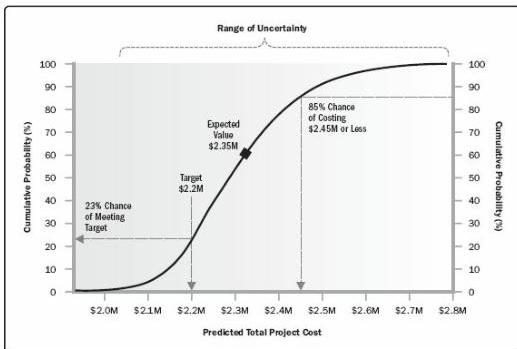

achieving any particular outcome or less. An example S-curve from a Monte Carlo cost risk analysis is shown in Figure 11-13.

Figure 11-13. Example S-Curve from Quantitative Cost Risk Analysis

For a quantitative schedule risk analysis, it is also possible to conduct a criticality analysis that determines which elements of the risk model have the greatest effect on the project critical path. A criticality index is calculated for each element in the risk model, which gives the frequency with which that element appears on the critical path during the simulation, usually expressed as a percentage. The output from a criticality analysis allows the project team to focus risk response planning efforts on those activities with the highest potential effect on the overall schedule performance of the project.

♦ Sensitivity analysis. Sensitivity analysis helps to determine which individual project risks or other sources of uncertainty have the most potential impact on project outcomes. It correlates variations in project outcomes with variations in elements of the quantitative risk analysis model.

One typical display of sensitivity analysis is the tornado diagram, which presents the calculated correlation coefficient for each element of the quantitative risk analysis model that can influence the project outcome. This can include individual project risks, project activities with high degrees of variability, or specific sources of ambiguity. Items are ordered by descending strength of correlation, giving the typical tornado appearance. An example tornado diagram is shown in Figure 11-14.

423