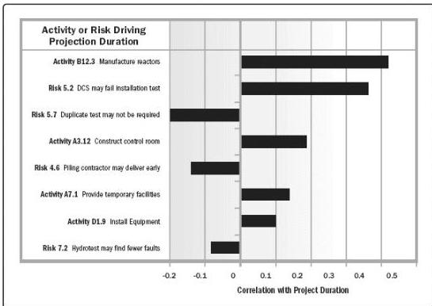

Figure 11-14. Example Tornado Diagram

◆ Decision tree analysis. Decision trees are used to support selection of the best of several alternative courses of action. Alternative paths through the project are shown in the decision tree using branches representing different decisions or events, each of which can have associated costs and related individual project risks (including both threats and opportunities). The end-points of branches in the decision tree represent the outcome from following that particular path, which can be negative or positive.

The decision tree is evaluated by calculating the expected monetary value of each branch, allowing the optimal path to be selected. An example decision tree is shown in Figure 11-15.

424