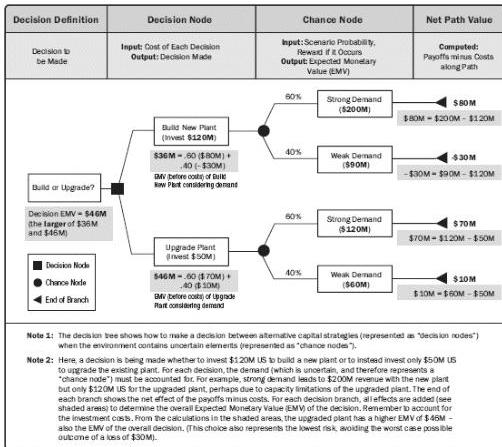

Figure 11-15. Example Decision Tree

- ◆ Influence diagrams. Influence diagrams are graphical aids to decision making under uncertainty. An influence diagram represents a project or situation within the project as a set of entities, outcomes, and influences, together with the relationships and effects between them. Where an element in the influence diagram is uncertain as a result of the existence of individual project risks or other sources of uncertainty, this can be represented in the influence diagram using ranges or probability distributions. The influence diagram is then evaluated using a simulation technique, such as Monte Carlo analysis, to indicate which elements have the greatest influence on key outcomes. Outputs from an influence diagram are similar to other quantitative risk analysis methods, including S-curves and tornado diagrams.

## 11.4.3 PERFORM QUANTITATIVE RISK ANALYSIS: OUTPUTS

### 11.4.3.1 PROJECT DOCUMENTS UPDATES

Project documents that can be considered as outputs for this process include but are not

425