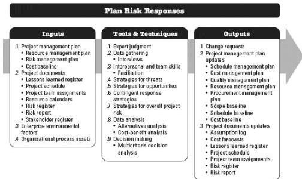

inserts activities into project documents and the project management plan as needed. This process is performed throughout the project. The inputs, tools and techniques, and outputs of the process are depicted in Figure 11-16. Figure 11-17 depicts the data flow diagram for the process.

Figure 11-16. Plan Risk Responses: Inputs, Tools & Techniques, and Outputs

427