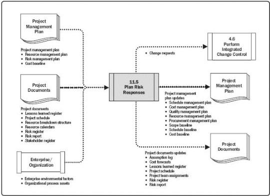

Figure 11-17. Plan Risk Responses: Data Flow Diagram

Effective and appropriate risk responses can minimize individual threats, maximize individual opportunities, and reduce overall project risk exposure. Unsuitable risk responses can have the converse effect. Once risks have been identified, analyzed, and prioritized, plans should be developed by the nominated risk owner for addressing every individual project risk the project team considers to be sufficiently important, either because of the threat it poses to the project objectives or the opportunity it offers. The project manager should also consider how to respond appropriately to the current level of overall project risk.

Risk responses should be appropriate for the significance of the risk, cost-effective in meeting the challenge, realistic within the project context, agreed upon by all parties involved, and owned by a responsible person. Selecting the optimal risk response from several options is often required. The strategy or mix of strategies most likely to be effective should be selected for each risk. Structured decision-making techniques may be used to choose the most appropriate response. For large or complex projects, it may be appropriate to use a mathematical optimization model or real options analysis as a basis for a more robust economic analysis of alternative risk response strategies.

Specific actions are developed to implement the agreed-upon risk response strategy, including primary and backup strategies, as necessary. A contingency plan (or fallback plan) can be developed for implementation if the selected strategy turns out not to be fully

428