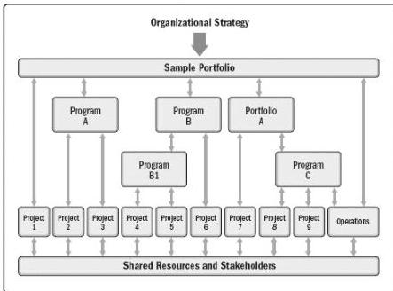

Figure 1-3. Portfolio, Programs, Projects, and Operations

Looking at project, program, and portfolio management from an organizational perspective:

- ◆ Program and project management focus on doing programs and projects the “right” way; and
- ◆ Portfolio management focuses on doing the “right” programs and projects.

Table 1-2 gives a comparative overview of portfolios, programs, and projects.

43