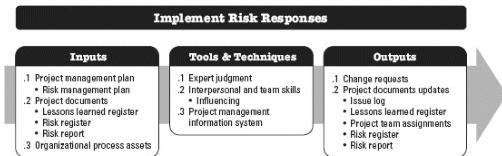

- Budget and schedule activities required to implement the chosen responses;
- Contingency plans and risk triggers that call for their execution;
- Fallback plans for use when a risk that has occurred and the primary response proves to be inadequate;
- Residual risks that are expected to remain after planned responses have been taken, as well as those that have been deliberately accepted; and
- Secondary risks that arise as a direct outcome of implementing a risk response.

◆ Risk report. Described in Section 11.2.3.2. The risk report may be updated to present agreed-upon responses to the current overall project risk exposure and high-priority risks, together with the expected changes that may be expected as a result of implementing these responses.

## 11.6 IMPLEMENT RISK RESPONSES

Implement Risk Responses is the process of implementing agreed-upon risk response plans. The key benefit of this process is that it ensures that agreed-upon risk responses are executed as planned in order to address overall project risk exposure, minimize individual project threats, and maximize individual project opportunities. This process is performed throughout the project. The inputs, tools and techniques, and outputs of the process are depicted in Figure 11-18. Figure 11-19 depicts the data flow diagram for the process.

Figure 11-18. Implement Risk Responses: Inputs, Tools & Techniques, and Outputs

438