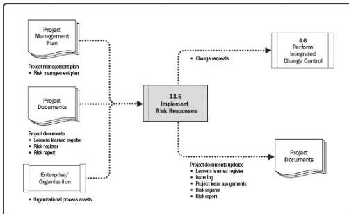

Figure 11-19. Implement Risk Responses: Data Flow Diagram

Proper attention to the Implement Risk Responses process will ensure that agreed-upon risk responses are actually executed. A common problem with Project Risk Management is that project teams spend effort in identifying and analyzing risks and developing risk responses, then risk responses are agreed upon and documented in the risk register and risk report, but no action is taken to manage the risk.

Only if risk owners give the required level of effort to implementing the agreed-upon responses will the overall risk exposure of the project and individual threats and opportunities be managed proactively.

## 11.6.1 IMPLEMENT RISK RESPONSES: INPUTS

### 11.6.1.1 PROJECT MANAGEMENT PLAN

Described in Section 4.2.3.1. Project management plan components include but are not limited to the risk management plan. Described in Section 11.1.3.1, the risk management plan lists the roles and responsibilities of project team members and other stakeholders for risk management. This information is used when allocating owners for agreed-upon risk responses. The risk management plan also defines the level of detail for the risk management methodology for the project. It also specifies risk thresholds for the project based on the risk appetite of key stakeholders, which define the acceptable target that the implementation of risk responses is required to achieve.

### 11.6.1.2 PROJECT DOCUMENTS

439