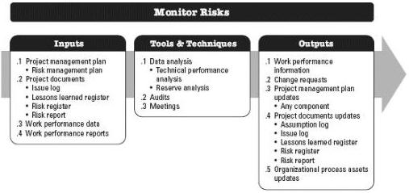
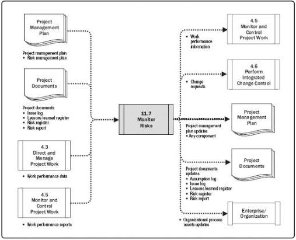

exposure and individual project risks. This process is performed throughout the project. The inputs, tools and techniques, and outputs of the process are depicted in Figure 11-20. Figure 11-21 depicts the data flow diagram for the process.

Figure 11-20. Monitor Risks: Inputs, Tools & Techniques, and Outputs

Figure 11-21. Monitor Risks: Data Flow Diagram

In order to ensure that the project team and key stakeholders are aware of the current level of risk exposure, project work should be continuously monitored for new, changing,

442