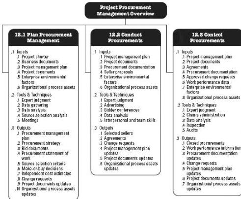

Figure 12-1 Project Procurement Management Overview

## KEY CONCEPTS FOR PROJECT PROCUREMENT MANAGEMENT

More than most other project management processes, there can be significant legal obligations and penalties tied to the procurement process. The project manager does not have to be a trained expert in procurement management laws and regulations but should be familiar enough with the procurement process to make intelligent decisions regarding contracts and contractual relationships. The project manager is typically not authorized to sign legal agreements binding the organization; this is reserved for those who have the authority to do so.

The Project Procurement Management processes involve agreements that describe the relationship between two parties—a buyer and a seller. Agreements can be as simple as the purchase of a defined quantity of labor hours at a specified labor rate, or they can be as complex as multiyear international construction contracts. The contracting approach and the contract itself should reflect the simplicity or complexity of the deliverables or required effort and should be written in a manner that complies with local, national, and international laws regarding contracts.

A contract should clearly state the deliverables and results expected, including any knowledge transfer from the seller to the buyer. Anything not in the contract cannot be legally enforced. When working internationally, project managers should keep in mind the

448