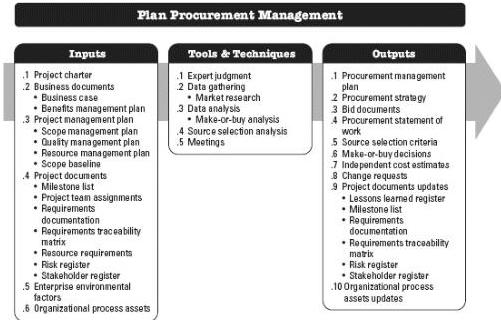

and, if so, what to acquire as well as how and when to acquire it. Goods and services may be procured from other parts of the performing organization or from external sources. This process is performed once or at predefined points in the project. The inputs, tools and techniques, and outputs of this process are depicted in Figure 12-2. Figure 12-3 depicts the data flow diagram of the process.

Figure 12-2. Plan Procurement Management: Inputs, Tools & Techniques, and Outputs

453