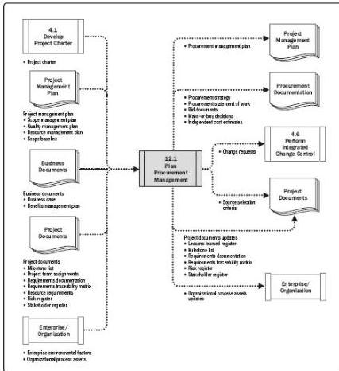

Figure 12-3. Plan Procurement Management: Data Flow Diagram

Defining roles and responsibilities related to procurement should be done early in the Plan Procurement Management process. The project manager should ensure that the project team is staffed with procurement expertise at the level required for the project. Participants in the procurement process may include personnel from the purchasing or procurement department as well as personnel from the buying organization's legal department. These responsibilities should be documented in the procurement management plan.

Typical steps might be:

- Prepare the procurement statement of work (SOW) or terms of reference (TOR).
- Prepare a high-level cost estimate to determine the budget.
- Advertise the opportunity.
- Identify a short list of qualified sellers.
- Prepare and issue bid documents.

454