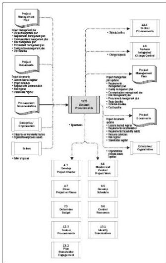

Figure 12-6. Conduct Procurements: Data Flow Diagram

## 12.2.1 CONDUCT PROCUREMENTS: INPUTS

### 12.2.1.1 PROJECT MANAGEMENT PLAN

Described in Section 4.2.3.1. Project management plan components include but are not limited to:

- ◆ Scope management plan. Described in Section 5.1.3.1. The scope management plan describes how the overall scope of work will be managed, including the scope performed by sellers.
- ◆ Requirements management plan. Described in Section 5.1.3.2. The requirements management plan describes how requirements will be analyzed, documented, and managed. The requirements management plan may include

469