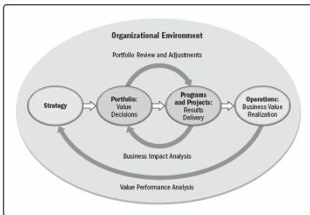

and differ in the way each contributes to the achievement of strategic goals:

- Portfolio management aligns portfolios with organizational strategies by selecting the right programs or projects, prioritizing the work, and providing the needed resources.
- Program management harmonizes its program components and controls interdependencies in order to realize specified benefits.
- Project management enables the achievement of organizational goals and objectives.

Within portfolios or programs, projects are a means of achieving organizational goals and objectives. This is often accomplished in the context of a strategic plan that is the primary factor guiding investments in projects. Alignment with the organization's strategic business goals can be achieved through the systematic management of portfolios, programs, and projects through the application of organizational project management (OPM). OPM is defined as a framework in which portfolio, program, and project management are integrated with organizational enablers in order to achieve strategic objectives.

The purpose of OPM is to ensure that the organization undertakes the right projects and allocates critical resources appropriately. OPM also helps to ensure that all levels in the organization understand the strategic vision, the initiatives that support the vision, the objectives, and the deliverables. Figure 1-4 shows the organizational environment where strategy, portfolio, programs, projects, and operations interact.

For more information on OPM, refer to *Implementing Organizational Project Management: A Practice Guide* [8].

Figure 1-4. Organizational Project Management

47