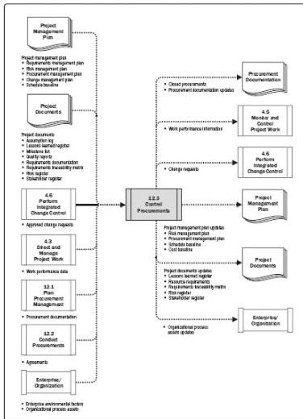

Figure 12-7. Control Procurements: Data Flow Diagram

Both the buyer and the seller administer the procurement contract for similar purposes. Each is required to ensure that both parties meet their contractual obligations and that their own legal rights are protected. The legal nature of the relationship makes it imperative that the project management team is aware of the implications of actions taken when controlling any procurement. On larger projects with multiple providers, a key aspect of contract administration is managing communication among the various providers.

Because of the legal aspect, many organizations treat contract administration as an organizational function that is separate from the project. While a procurement administrator may be on the project team, this individual typically reports to a supervisor from a different department.

Control Procurements includes application of the appropriate project management processes to the contractual relationship(s) and integration of the outputs from these processes into the overall management of the project. This integration often occurs at

478