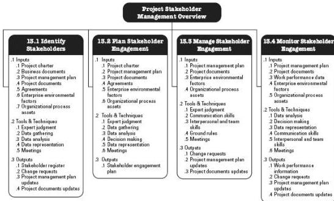

Figure 13-1. Project Stakeholder Management Overview

## KEY CONCEPTS FOR PROJECT STAKEHOLDER MANAGEMENT

Every project has stakeholders who are impacted by or can impact the project in a positive or negative way. Some stakeholders may have a limited ability to influence the project's work or outcomes; others may have significant influence on the project and its expected outcomes. Academic research and analyses of high-profile project disasters highlight the importance of a structured approach to the identification, prioritization, and engagement of all stakeholders. The ability of the project manager and team to correctly identify and engage all stakeholders in an appropriate way can mean the difference between project success and failure. To increase the chances of success, the process of stakeholder identification and engagement should commence as soon as possible after the project charter has been approved, the project manager has been assigned and the team begins to form.

Stakeholder satisfaction should be identified and managed as a project objective. The key to effective stakeholder engagement is a focus on continuous communication with all stakeholders, including team members, to understand their needs and expectations, address issues as they occur, manage conflicting interests, and foster appropriate stakeholder engagement in project decisions and activities.

The process of identifying and engaging stakeholders for the benefit of the project is iterative. Although the processes in Project Stakeholder Management are described only once, the activities of identification, prioritization, and engagement should be reviewed and updated routinely, and at least at the following times when:

488