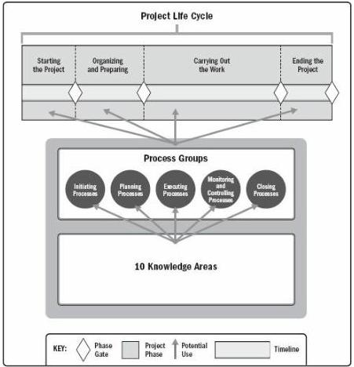

Figure 1-5. Interrelationship of PMBOK® Guide Key Components in Projects

### 1.2.4.1 PROJECT AND DEVELOPMENT LIFE CYCLES

A project life cycle is the series of phases that a project passes through from its start to its completion. It provides the basic framework for managing the project. This basic framework applies regardless of the specific project work involved. The phases may be sequential, iterative, or overlapping. All projects can be mapped to the generic life cycle shown in Figure 1-5.

Project life cycles can be predictive or adaptive. Within a project life cycle, there are generally one or more phases that are associated with the development of the product, service, or result. These are called a development life cycle. Development life cycles can be predictive, iterative, incremental, adaptive, or a hybrid model:

- In a predictive life cycle, the project scope, time, and cost are determined in the early phases of the life cycle. Any changes to the scope are carefully managed. Predictive life cycles may also be referred to as waterfall life cycles.
- In an iterative life cycle, the project scope is generally determined early in the

49