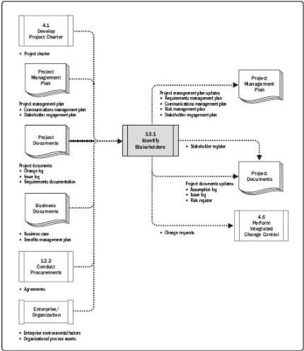

# Identify Stakeholders

# Inputs

.1 Project charter
2 Business documents

Business case
Benefits management plan

3. Project management plan

- Communications management plan
Stakeholder engagement plan

4. Project documents

- Change log
- Issue log
- Requirements documentation

5 Agreements
6 Enterprise environmental factors
7 Organizational process assets

# Tools & Techniques

.1 Expert judgment
2 Data gathering

- Questionnaires and surveys
- Brainstorming

3. Data analysis

Stakeholder analysis
- Document analysis

4. Data representation

Stakeholder mapping/ representation

5. Meetings

# Outputs

.1 Stakeholder register
2 Change requests
3 Project management plan updates

- Requirements management plan
- Communications management plan
- Risk management plan
Stakeholder engagement plan

4. Project documents updates

Assumption log
- Issue log
Risk register

Figure 13-2. Identify Stakeholders: Inputs, Tools & Techniques, and Outputs

Figure 13-3. Identify Stakeholders: Data Flow Diagram

491