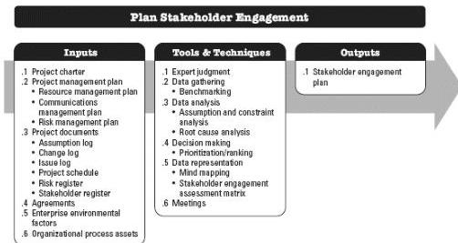

stakeholder engagement plan.

### 13.1.3.4 PROJECT DOCUMENTS UPDATES

Project documents that may be updated as a result of carrying out this process include but are not limited to:

- ◆ Assumption log. Described in Section 4.1.3.2. Much of the information about the relative power, interest, and engagement of stakeholders is based on assumptions. This information is entered into the assumption log. Additionally, any constraints associated with interacting with specific stakeholders are entered as well.
- ◆ Issue log. Described in Section 4.3.3.3. New issues raised as a result of this process are recorded in the issue log.
- ◆ Risk register. Described in Section 11.2.3.1. New risks identified during this process are recorded in the risk register and managed using the risk management processes.

## 13.2 PLAN STAKEHOLDER ENGAGEMENT

Plan Stakeholder Engagement is the process of developing approaches to involve project stakeholders based on their needs, expectations, interests, and potential impact on the project. The key benefit is that it provides an actionable plan to interact effectively with stakeholders. This process is performed periodically throughout the project as needed.

The inputs, tools and techniques, and outputs of the process are depicted in Figure 13-4. Figure 13-5 depicts the data flow diagram for the process.

Figure 13-4. Plan Stakeholder Engagement: Inputs, Tools & Techniques, and Outputs

498