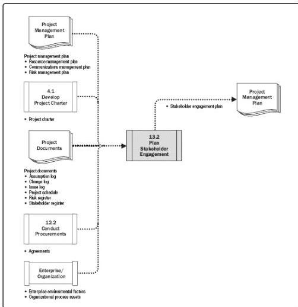

Figure 13-5. Plan Stakeholder Engagement: Data Flow Diagram

An effective plan that recognizes the diverse information needs of the project's stakeholders is developed early in the project life cycle and is reviewed and updated regularly as the stakeholder community changes. The first version of the stakeholder engagement plan is developed after the initial stakeholder community has been identified by the Identify Stakeholder process. The stakeholder engagement plan is updated regularly to reflect changes to the stakeholder community. Typical trigger situations requiring updates to the plan include but are not limited to:

- ◆ When it is the start of a new phase of the project;
- ◆ When there are changes to the organization structure or within the industry;
- ◆ When new individuals or groups become stakeholders, current stakeholders are no longer part of the stakeholder community, or the importance of particular stakeholders to the project's success changes; and

499