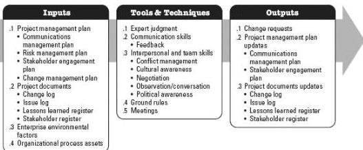
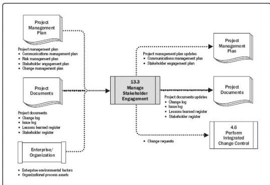

## Manage Stakeholder Engagement

Figure 13-7. Manage Stakeholder Engagement: Inputs, Tools & Techniques, and Outputs

Figure 13-8. Manage Stakeholder Engagement: Data Flow Diagram

Manage Stakeholder Engagement involves activities such as:

- ◆ Engaging stakeholders at appropriate project stages to obtain, confirm, or maintain their continued commitment to the success of the project;
- ◆ Managing stakeholder expectations through negotiation and communication;
- ◆ Addressing any risks or potential concerns related to stakeholder management

505