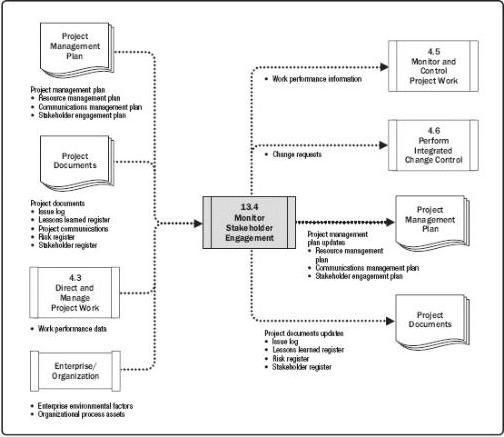

# Monitor Stakeholder Engagement

# Inputs

.1 Project management plan

Resource management plan
Communications management plan
Stakeholder engagement plan

.2 Project documents

- Issue log
Lessons learned register
- Project communications
Risk register
Stakeholder register

3 Work performance data
4 Enterprise environmental factors
5 Organizational process assets

# Tools & Techniques

.1 Data analysis

Alternatives analysis
Root cause analysis
Stakeholder analysis

.2 Decision making

Multicriteria decision analysis
Voting

.3 Data representation

Stakeholder engagement assessment matrix

.4 Communication skills

Feedback
Presentations

.5 Interpersonal and team skills

Active listening
Cultural awareness
- Leadership
Networking
Political awareness

.6 Meetings

# Outputs

.1 Work performance information
2 Change requests
3 Project management plan updates

Resource management plan
Communications management plan
Stakeholder engagement plan

.4 Project documents updates

Issue log
Lessons learned register
Risk register
Stakeholder register

Figure 13-9. Monitor Stakeholder Engagement: Inputs, Tools & Techniques, and Outputs

Figure 13-10. Monitor Stakeholder Engagement: Data Flow Diagram

511