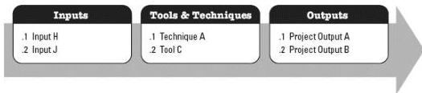

- ◆ Project business case (see Section 1.2.6.1),
- ◆ Project charter (see Section 4.1),
- ◆ Project management plan (see Section 4.2), and
- ◆ Benefits management plan (see Section 1.2.6.2).

A decision (e.g., go/no-go decision) is made as a result of this comparison to:

- ◆ Continue to the next phase,
- ◆ Continue to the next phase with modification,
- ◆ End the project,
- ◆ Remain in the phase, or
- ◆ Repeat the phase or elements of it.

Depending on the organization, industry, or type of work, phase gates may be referred to by other terms such as, phase review, stage gate, kill point, and phase entrance or phase exit. Organizations may use these reviews to examine other pertinent items which are beyond the scope of this guide, such as product-related documents or models.

#### 1.2.4.4 PROJECT MANAGEMENT PROCESSES

The project life cycle is managed by executing a series of project management activities known as project management processes. Every project management process produces one or more outputs from one or more inputs by using appropriate project management tools and techniques. The output can be a deliverable or an outcome. Outcomes are an end result of a process. Project management processes apply globally across industries.

Project management processes are logically linked by the outputs they produce. Processes may contain overlapping activities that occur throughout the project. The output of one process generally results in either:

- ◆ An input to another process, or
- ◆ A deliverable of the project or project phase.

Figure 1-6 shows an example of how inputs, tools and techniques, and outputs relate to each other within a process, and with other processes.

Figure 1-6. Example Process: Inputs, Tools & Techniques, and Outputs

52