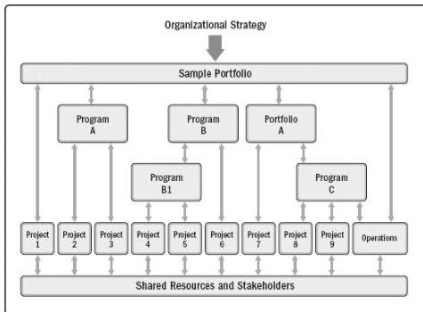

Figure 1-1. Example of Portfolio, Program, and Project Management Interfaces

### 1.3 LINKING ORGANIZATIONAL GOVERNANCE AND PROJECT GOVERNANCE

There are various types of governance including organizational governance; organizational project management (OPM) governance; and portfolio, program, and project governance. Organizational governance is a structured way to provide direction and control through policies, and processes, to meet strategic and operational goals. Organizational governance is typically conducted by a board of directors to ensure accountability, fairness, and transparency to its stakeholders. Organizational governance principles, decisions, and processes may influence and impact the governance of portfolios, programs, and projects in the following ways:

- ◆ Enforcing legal, regulatory, standards, and compliance requirements,
- ◆ Defining ethical, social, and environmental responsibilities, and
- ◆ Specifying operational, legal, and risk policies.

Project governance is the framework, functions, and processes that guide project management activities in order to create a unique product, service, or result to meet organizational, strategic, and operational goals. Governance at the project level includes:

- ◆ Guiding and overseeing the management of project work;
- ◆ Ensuring adherence to policies, standards, and guidelines;

524