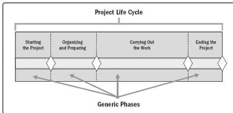

with a start and end or control point (sometimes referred to as a phase review, phase gate, control gate, or other similar term). At the control point, the project charter and business documents are reexamined based on the current environment. At that time, the project's performance is compared to the project management plan to determine if the project should be changed, terminated, or continue as planned.

The project life cycle can be influenced by the unique aspects of the organization, industry, development method, or technology employed. While every project has a start and end, the specific deliverables and work that take place vary widely depending on the project. The life cycle provides the basic framework for managing the project, regardless of the specific work involved.

Though projects vary in size and the amount of complexity they contain, a typical project can be mapped to the following project life cycle structure (see Figure 1-2):

- Starting the project,
- Organizing and preparing,
- Carrying out the work, and
- Closing the project.

Figure 1-2. Generic Depiction of a Project Life Cycle

A generic life cycle structure typically displays the following characteristics:

- Cost and staffing levels are low at the start, increase as the work is carried out, and drop rapidly as the project draws to a close.
- Risk is greatest at the start of the project as illustrated by Figure 1-3. These factors decrease over the life cycle of the project as decisions are reached and as deliverables are accepted.
- The ability of stakeholders to influence the final characteristics of the project's product, without significantly impacting cost and schedule, is highest at the

527