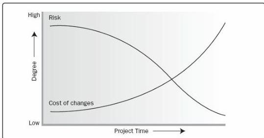

start of the project and decreases as the project progresses toward completion. Figure 1-3 illustrates the cost of making changes and correcting errors typically increases substantially as the project approaches completion.

Figure 1-3. Impact of Variables Over Time

## 1.6 PROJECT STAKEHOLDERS

A stakeholder is an individual, group, or organization that may affect, be affected by, or perceive itself to be affected by a decision, activity, or outcome of a project. Project stakeholders may be internal or external to the project, they may be actively involved, passively involved, or unaware of the project. Project stakeholders may have a positive or negative impact on the project, or be positively or negatively impacted by the project. Examples of stakeholders include but are not limited to:

- ◆ *Internal stakeholders:*
  - ■ Sponsor,
  - ■ Resource manager,
  - ■ Project management office (PMO),
  - ■ Portfolio steering committee,
  - ■ Program manager,
  - ■ Project managers of other projects, and
  - ■ Team members.
- ◆ *External stakeholders:*

528