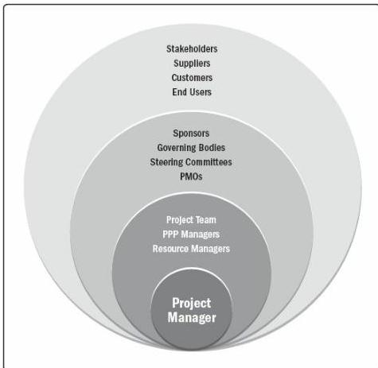

- Customers,
- End users,
- Suppliers,
- Shareholders
- Regulatory bodies, and
- Competitors

Figure 1-4. Examples of Project Stakeholders

Figure 1-4 shows examples of project stakeholders. Stakeholder involvement may range from occasional contributions in surveys and focus groups to full project sponsorship that includes the provision of financial, political, or other types of support. The type and level of project involvement can change over the course of the project's life cycle. Therefore, successfully identifying, analyzing, and engaging stakeholders and effectively managing their project expectations and participation throughout the project life cycle is critical to project success.

529