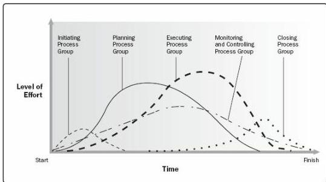

activities may occur throughout the project life cycle, especially when the project uses rolling wave planning or an adaptive development approach. Many of the monitoring and control processes are ongoing from the start of the project, until it is closed out.

The output of one process generally becomes an input to another process or is a deliverable of the project or project phase. For example, the project management plan and project documents (e.g., risk register, responsibility assignment matrix, etc.) produced in the Planning Process Group are provided to the Executing Process Group where updates are made. Figure 1-4 illustrates an example of how Process Groups can overlap during a project or phase.

Process Groups are not project phases. If the project is divided into phases, the processes in the Process Groups interact within each phase. It is possible that all Process Groups could be represented within a phase, as illustrated in Figure 1-5. As projects are separated into distinct phases, such as concept development, feasibility study, design, prototype, build, or test, etc., processes in each of the Process Groups are repeated as necessary in each phase until the completion criteria for that phase have been satisfied.

Figure 1-5. Example of Process Group Interactions Within a Project or Phase

Table 1-1 shows the 49 processes mapped to the Process Groups and Knowledge Areas.

533