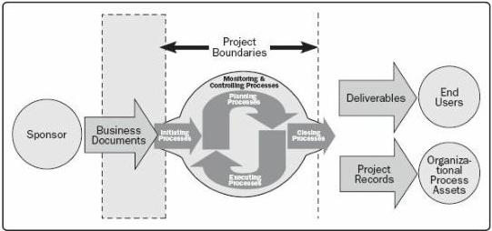
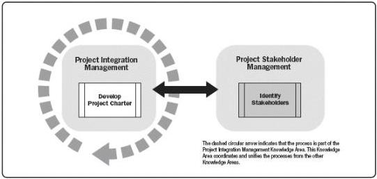

Figure 2-1. Project Boundaries

As described in Section 1.5, projects are often divided into phases. When this is done, information from processes in the Initiating Process Group is reexamined to determine if the information is still valid. Revisiting the Initiating processes at the start of each phase helps keep the project focused on the business need that the project was undertaken to address. The project charter, business documents, and success criteria are verified. The influence, drivers, expectations, and objectives of the project stakeholders are reviewed.

Involving the sponsors, customers, and other stakeholders during initiation creates a shared understanding of success criteria. It also increases the likelihood of deliverable acceptance when the project is complete, and stakeholder satisfaction throughout the project.

The Initiating Process Group includes the project management processes identified in Sections 2.1 through 2.2.

Figure 2-2. Initiating Process Group

539