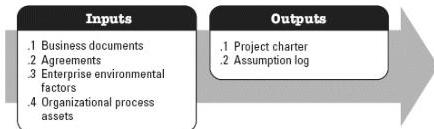
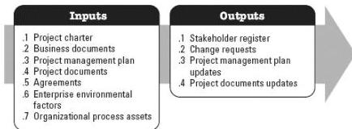

## 2.1 DEVELOP PROJECT CHARTER

Develop Project Charter is the process of developing a document that formally authorizes the existence of a project and provides the project manager with the authority to apply organizational resources to project activities. The key benefits of this process are that it provides a direct link between the project and the strategic objectives of the organization, creates a formal record of the project, and shows the organizational commitment to the project. This process is performed once, or at predefined points in the project. The inputs and outputs of this process are shown in Figure 2-3.

Figure 2-3. Develop Project Charter: Inputs and Outputs

## 2.2 IDENTIFY STAKEHOLDERS

Identify Stakeholders is the process of identifying project stakeholders regularly and analyzing and documenting relevant information regarding their interests, involvement, interdependencies, influence, and potential impact on project success. The key benefit of this process is that it enables the project team to identify the appropriate focus for engagement of each stakeholder or group of stakeholders. This process is performed periodically throughout the project as needed. The inputs and outputs of this process are depicted in Figure 2-4.

Figure 2-4. Identify Stakeholders: Inputs and Outputs

The needs of the project determine which components of the project management plan and which project documents are necessary.

540