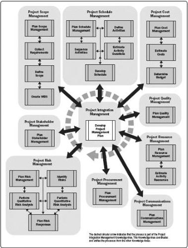

Figure 3-1. Planning Process Group

# 3.1 DEVELOP PROJECT MANAGEMENT PLAN

Develop Project Management Plan is the process of defining, preparing, and coordinating all plan components and consolidating them into an integrated project management plan. The key benefit of this process is the production of a comprehensive document that defines the basis of all project work and how the work will be performed. This process is performed once or at predefined points in the project. The inputs and outputs of this process are depicted in Figure 3-2.

543