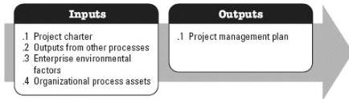
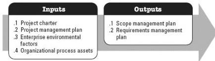

**Figure 3-2. Develop Project Management Plan: Inputs and Outputs**

The needs of the project determine which components of the project management plan and which project documents are necessary.

### 3.2 PLAN SCOPE MANAGEMENT

Plan Scope Management is the process of creating a scope management plan that documents how the project and product scope will be defined, validated, and controlled. The key benefit of this process is that it provides guidance and direction on how scope will be managed throughout the project. This process is performed once or at predefined points in the project. The inputs and outputs of this process are depicted in Figure 3-3.

**Figure 3-3. Plan Scope Management: Inputs and Outputs**

The needs of the project determine which components of the project management plan are necessary.

#### 3.2.1 PROJECT MANAGEMENT PLAN COMPONENTS

Examples of project management plan components that may be inputs for this process include but are not limited to:

- ◆ Quality management plan,
- ◆ Project life cycle description, and
- ◆ Development approach.

544