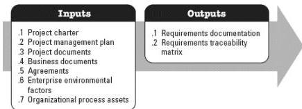

### 3.3 COLLECT REQUIREMENTS

Collect Requirements is the process of determining, documenting, and managing stakeholder needs and requirements to meet objectives. The key benefit of this process is that it provides the basis for defining the product scope and project scope. This process is performed once or at predefined points in the project. The inputs and outputs of this process are depicted in Figure 3-4.

Figure 3-4. Collect Requirements: Inputs and Outputs

The needs of the project determine which components of the project management plan and which project documents are necessary.

#### 3.3.1 PROJECT MANAGEMENT PLAN COMPONENTS

Examples of project management plan components that may be inputs for this process include but are not limited to:

- Scope management plan,
- Requirements management plan, and
- Stakeholder engagement plan.

#### 3.3.2 PROJECT DOCUMENTS EXAMPLES

Examples of project documents that may be inputs for this process include but are not limited to:

- Assumption log,
- Lessons learned register, and
- Stakeholder register.

### 3.4 DEFINE SCOPE

545