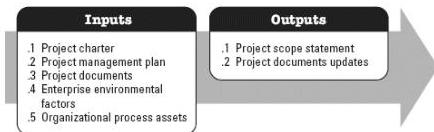

Define Scope is the process of developing a detailed description of the project and product. The key benefit of this process is that it describes the product, service, or result boundaries and acceptance criteria. This process is performed once or at predefined points in the project. The inputs and outputs of this process are depicted in Figure 3-5.

Figure 3-5. Define Scope: Inputs and Outputs

The needs of the project determine which components of the project management plan and which project documents are necessary.

### 3.4.1 PROJECT MANAGEMENT PLAN COMPONENTS

An example of a project management plan component that may be an input for this process includes but is not limited to the scope management plan.

### 3.4.2 PROJECT DOCUMENTS EXAMPLES

Examples of project documents that may be inputs for this process include but are not limited to:

- Assumption log,
- Requirements documentation, and
- Risk register.

### 3.4.3 PROJECT DOCUMENTS UPDATES

Project documents that may be updated as a result of this process include but are not limited to:

- Assumption log,
- Requirements documentation,
- Requirements traceability matrix, and
- Stakeholder register.

546