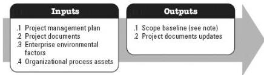

### 3.5 CREATE WBS

Create Work Breakdown Structure (WBS) is the process of subdividing project deliverables and project work into smaller, more manageable components. The key benefit of this process is that it provides a framework of what has to be delivered. This process is performed once or at predefined points in the project. The inputs and outputs of this process are depicted in Figure 3-6.

Note: The scope baseline is the approved version of a scope statement, WBS, and its associated WBS dictionary.

Figure 3-6. Create WBS: Inputs and Outputs

The needs of the project determine which components of the project management plan and which project documents are necessary.

### 3.5.1 PROJECT MANAGEMENT PLAN COMPONENTS

An example of a project management plan component that may be an input for this process includes but is not limited to the scope management plan.

### 3.5.2 PROJECT DOCUMENTS EXAMPLES

Examples of project documents that may be inputs for this process include but are not limited to:

- Project scope statement, and
- Requirements documentation.

### 3.5.3 PROJECT DOCUMENTS UPDATES

Project document that may be updated as a result of this process include but is not limited to:

- Assumption log, and
- Requirements documentation.

547